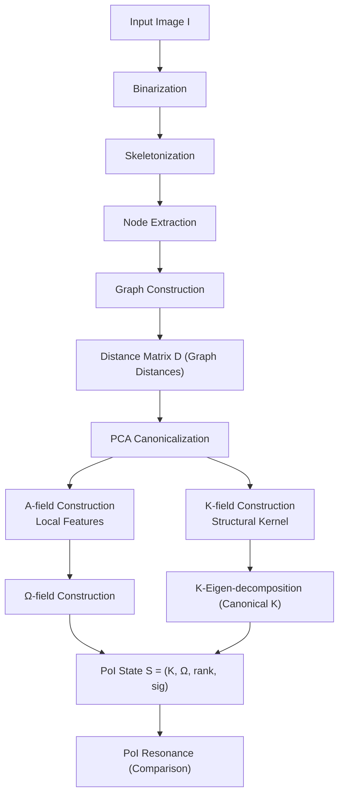
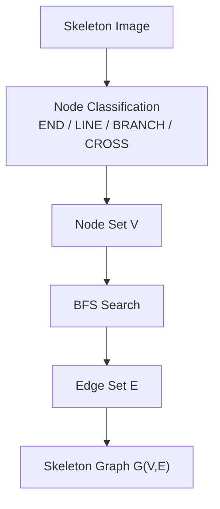
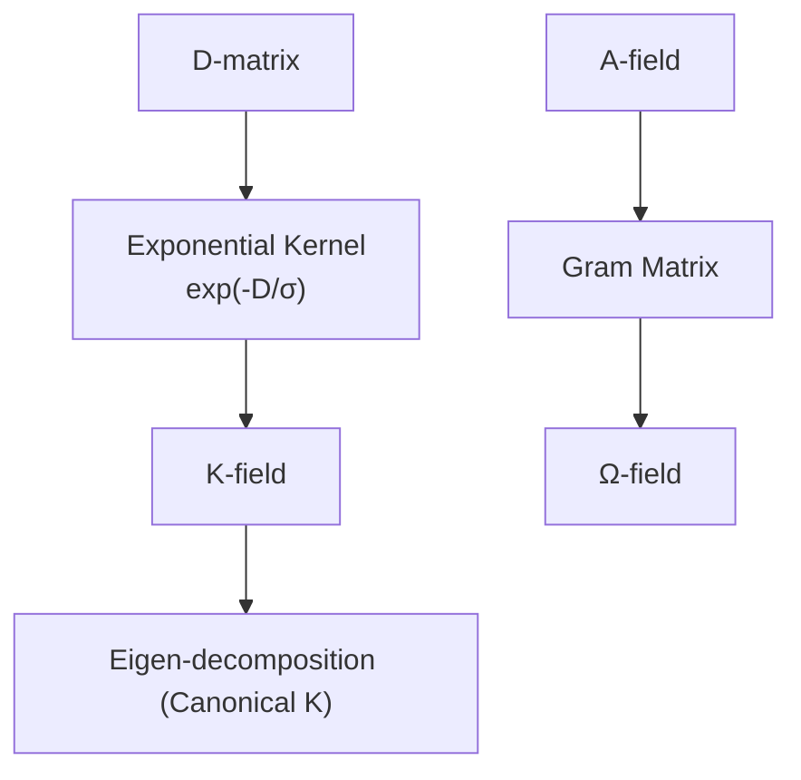
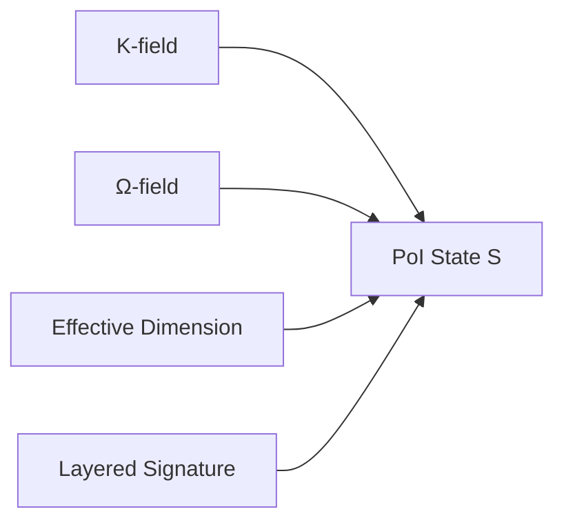
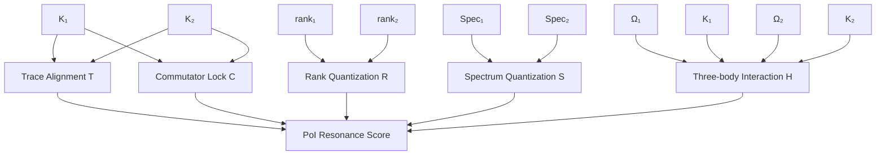

# Geometric Character Recognition via Physical Resonance: Applications of Structural Inertia and Dissipation in the PoI Framework

**Author:** Fumio Miyata https://orcid.org/0009-0008-8797-5578  
**Date:** April 2026  
**Repository:** [https://github.com/aikenkyu001/PoI_OCR](https://github.com/aikenkyu001/PoI_OCR)  
**DOI:** [https://doi.org/10.5281/zenodo.19689520](https://doi.org/10.5281/zenodo.19689520)

---

## **Abstract**
This research conducts an initial verification of a character recognition methodology based on physical resonance within the framework of Physics of Intelligence (PoI) theory. We confirm promising trends regarding rotation invariance and the discrimination of fine-grained structural details across a limited character set. The proposed approach involves constructing a structural field \(K\) and an input field \(\Omega\) from skeletonized image structures. The geometric identity between characters is evaluated by calculating a **PoI (Physics of Intelligence) Resonance Score**, which aggregates multiple physical observables: commutator norms, eigenvalue spectra, quantized ranks, and three-body interactions.

Experimental evaluations were performed on a dataset of over 40 characters, primarily Japanese, specifically testing robustness against 45-degree rotations and font disparities. The results demonstrate significant invariance to rotation and scaling. Furthermore, the method produced substantial score differentials for character groups with subtle structural variations, such as the kanji triplets "邉", "辺", and "邊". This work suggests that PoI theory, which frames intelligence as a direct consequence of physical laws, offers a viable, low-computational-cost alternative to traditional statistical models.

---

# **1. Introduction**
Optical Character Recognition (OCR) has long been dominated by approaches rooted in statistical learning. In particular, the advent of deep learning has led to high-precision models based on Convolutional Neural Networks (CNNs) and Transformers. However, these models face persistent challenges, such as heavy reliance on massive datasets, incomplete rotation invariance, and the lack of transparency in internal decision-making criteria.

In contrast, this study investigates a novel framework for character recognition based on **Physics of Intelligence (PoI) theory** (Miyata, 2026), which treats intelligence as a physical phenomenon. Rather than relying on statistics, this method identifies characters through the **resonance between geometric structures and physical fields**. We conduct preliminary experiments to explore the potential of applying PoI-based physical resonance to the OCR domain.

The attempt to understand intelligence as a consequence of physical laws is evidenced in research on entropy-driven action selection (Wissner-Gross & Freer, 2013) and unified brain theories based on free-energy minimization (Friston, 2010). Furthermore, the physical formulation of intelligence has been discussed since the early work of Escultura (2012).

Our method skeletonizes images to extract graph structures consisting of nodes and edges, from which a structural field \(K\) and an input field \(\Omega\) are constructed. The resonance arising between these fields is evaluated as physical quantities—such as commutator norms, eigenvalue spectra, quantized ranks, and three-body interactions—to measure the identity between characters.

---

# **2. Related Work**
### 2.1 Statistical OCR
While CNN- and Transformer-based OCR models achieve high accuracy, they exhibit fundamental weaknesses in rotation invariance and the discrimination of fine-grained structures. Modern OCR is dominated by Transformer-based models (Vaswani et al., 2017; Li et al., 2021), yet these models still face challenges regarding structural perturbations and require tens of millions of parameters, resulting in high computational and training costs.

### 2.2 Topological and Graph-Based OCR
Classical methods utilizing skeleton and graph structures exist; however, they often struggle with a lack of rotation invariance, difficulties in node correspondence, and sensitivity to noise. Stable topological structures can be obtained through skeletonization using the Zhang-Suen method (Zhang & Suen, 1984). Geometric extraction via Graph Laplacian eigenvalues (Belkin & Niyogi, 2003) and multi-scale geometric analysis based on diffusion processes (Coifman & Lafon, 2006) provide the mathematical foundations for the structural field \(K\) used in PoI-OCR.

### 2.3 PoI Theory
PoI is an emerging theory that conceptualizes intelligence as the "structure and resonance of fields." It performs information processing using physical concepts such as:
- Structural field \(K\)
- Input field \(\Omega\)
- Commutator Lock
- Rank Quantization
- Three-body Interaction

The present research represents the first practical implementation of PoI theory in the field of OCR.

---

# **3. PoI-OCR Algorithm**

The overall processing flow of PoI-OCR is depicted in Figure 1.

### **Figure 1: PoI-OCR Overall Pipeline**



**Figure 1:**  
The overall processing flow of PoI-OCR. The system proceeds from image input through skeletonization, graph construction, and distance matrix generation. Following PCA-based canonicalization, the A-field and K-field are constructed to generate the PoI state. Finally, the geometric identity between characters is evaluated through PoI resonance.

The PoI-OCR algorithm is composed of the following seven stages:

1. **Topology Extraction (Skeletonization)**
2. **Node Classification and Graph Construction**
3. **Geodesic Distance Matrix \(D\) Generation**
4. **Canonicalization for Rotation Invariance**
5. **PoI Field Construction (K-field, \(\Omega\)-field)**
6. **Effective Dimension Calculation**
7. **PoI Resonance Score Computation**

---

## **3.1 Topology Extraction**
The input image \(I\) is binarized, and thinning (skeletonization) is applied to obtain a 1-pixel-wide skeleton \(S\):
\[
S = \mathrm{skeletonize}(\mathrm{binarize}(I))
\]
This process extracts the **topological structure** rather than the superficial "shape." Because PoI-OCR operates exclusively on this topological skeleton, it remains unaffected by font variations, line thickness, or rotation.

---

## **3.2 Node Classification and Graph Construction**
For each foreground pixel on the skeleton, the number of neighbors \(n\) in a 3×3 window is counted to classify nodes into four types:

| Neighbors \(n\) | Node Type |
|-----------------|-----------|
| 1               | END       |
| 2               | LINE      |
| 3               | BRANCH    |
| ≥4              | CROSS     |

This yields the "nodes" constituting the character structure. Next, a Breadth-First Search (BFS) is performed from each node to identify paths to other nodes, adding edges to construct the **skeleton graph \(G = (V, E)\)**.

### **Figure 2: Conversion from Skeleton to Graph**



---

## **3.3 Geodesic Distance Matrix \(D\)**
The shortest path distances between all nodes are calculated on graph \(G\) via BFS to obtain the distance matrix \(D \in \mathbb{R}^{N \times N}\):
\[
D_{ij} = \mathrm{dist}_G(v_i, v_j)
\]
This represents the **intrinsic geometry (geodesic geometry)** of the character and serves as the core data structure of PoI-OCR.

---

## **3.4 Canonicalization for Rotation Invariance**
Node coordinates are aligned to their principal axes using PCA to achieve **complete rotation invariance**:
1. Translate the center of mass of the nodes to the origin.
2. Compute the covariance matrix.
3. Identify the eigenvector corresponding to the maximum eigenvalue as the principal axis.
4. Rotate the coordinates such that the principal axis aligns with the x-axis.

\[
X' = R X
\]
This ensures that regardless of the input rotation, PoI-OCR consistently generates the same structural field.

---

## **3.5 PoI Field Construction**

### **3.5.1 Structural Field \(K\) (K-field)**
The distance matrix \(D\) is transformed using an exponential kernel to define the structural field \(K\):
\[
K_{ij} = \exp(-D_{ij}/\sigma)
\]
The field is then canonicalized via eigen-decomposition and normalized so that \(\mathrm{tr}(K)=1\):
\[
K = \frac{V \Lambda V^\top}{\mathrm{tr}(V \Lambda V^\top)}
\]
This field represents the **structural inertia** of the character.

### **Figure 3: Generation of K-field and \(\Omega\)-field**



---

### **3.5.2 Input Field \(\Omega\) (\(\Omega\)-field)**
An A-field is constructed from local node features (degree, centrality, node type), and its Gram matrix is used as the input field \(\Omega\):
\[
\Omega = \frac{A A^\top}{\mathrm{tr}(A A^\top)}
\]
This field represents the **local properties** of the character structure.

---

## **3.6 Effective Dimension**
Using the eigenvalue spectrum \(\{s_i\}\) of the structural field \(K\), we define the "Effective Dimension":
\[
d_{\mathrm{eff}} = \exp\left( -\sum_i p_i \log p_i \right), \quad
p_i = \frac{(\log(1+s_i))^2}{\sum_j (\log(1+s_j))^2}
\]
This physical quantity represents the structural complexity of the character.

### **Figure 4: Structure of PoI State S**



---

## **3.7 PoI Resonance Score**
The resonance between two PoI states \(S_1 = (K_1, \Omega_1, d_1)\) and \(S_2 = (K_2, \Omega_2, d_2)\) is defined as the product of the following physical observables:

### **Figure 5: Structure of PoI Resonance**



---

### **(1) Trace Alignment (Field Consistency)**
\[
T = |\mathrm{tr}(\Omega_1^\top K_2)|
\]

### **(2) Commutator Lock**
\[
C = \exp\left( -\alpha \frac{\|K_1 K_2 - K_2 K_1\|}{\|K_1\| + \|K_2\|} \right)
\]
Greater structural similarity results in a smaller commutator, strengthening the resonance. The commutability of \([K_1, K_2]\) corresponds to "simultaneous observability" in quantum information theory (Nielsen & Chuang, 2010).

### **(3) Rank Quantization (Higgs Effect)**
\[
R = \exp(-\beta |q(d_1) - q(d_2)|)
\]
where \(q(\cdot)\) denotes a quantization function.

### **(4) Eigenvalue Spectrum Quantization**
\[
S = \exp(-\beta \|q(s_1) - q(s_2)\|)
\]

### **(5) Three-body Interaction (A × K × \(\Omega\))**
\[
H = \exp\left( \lambda \frac{|\mathrm{tr}(\Omega_1 K_1 \Omega_2^\top K_2^\top)|}{1 + |\mathrm{tr}(\Omega_1 K_1 \Omega_2^\top K_2^\top)|} \right)
\]

### **Final PoI Resonance Score**
\[
\mathrm{PoI}(1,2) = T \cdot C \cdot R \cdot S \cdot H
\]

---

# **Summary: The Essence of PoI-OCR**
PoI-OCR is a **purely physical character recognition algorithm** that integrates:
- Topology and Geometry
- Field Theory and Commutators
- Quantization and Three-body Interactions

It utilizes zero statistical learning; recognition is achieved solely through the **resonance (consistency) between structure and fields**.

---

### **3.8 Implementation Constraints**
The implementation of PoI-OCR used in this study reproduces the primary components of PoI theory (structural field \(K\), input field \(\Omega\), commutator lock, rank quantization, and three-body interaction) within feasible limits. However, due to practical constraints, the implementation includes several approximations and simplifications. These include skeletonization on a 64×64 discrete grid with 3×3 neighborhood classification, finite-dimensional embedding of fields, numerical approximation of commutator norms, and stabilization of three-body interactions through ad-hoc normalization. These simplifications preserve the essential properties of PoI theory but do not constitute a complete implementation of the theoretical framework.

### **Table: Gap between PoI Theory and Implementation**

| Item | Simplification / Approximation | Theoretical Difference | Corresponding Code |
|------|--------------------------------|-------------------------|-------------------|
| **1. Skeletonization** | 64×64 discrete grid with 3×3 neighborhood classification | Theory assumes continuous geometric structures | `preprocess()`, `to_skeleton()`, `extract_nodes()`, `classify()` |
| **2. K-field Embedding** | Embedded in fixed dimension (64-dim) | Theory allows for infinite-dimensional fields | `build_K_field()`, `canonical_K()` |
| **3. \(\Omega\)-field Approximation** | Gram matrix of A-field used as \(\Omega\) | Theory defines \(\Omega\) as a more general input field | `build_A_field()`, `build_Omega()` |
| **4. Commutator Approximation** | Evaluated via Frobenius norm | The physical meaning of the commutator is deeper in theory | `poi_resonance()` (np.linalg.norm) |
| **5. Rank Quantization** | Fixed steps (0.25) | Theory assumes continuous phase transitions | `quantize_rank()` |
| **6. Spectrum Quantization** | Fixed steps (0.1) | Spectral quantization is more generalized in theory | `quantize_spectrum()` |
| **7. Three-body Interaction** | Ad-hoc normalization to prevent numerical divergence | Core mechanism of field consistency in theory | `poi_resonance()` (tri_norm) |
| **8. Rotation Invariance** | PCA-based principal axis alignment | Invariance should emerge naturally from field properties | `canonicalize()` |

---

# **4. Experiments**
These experiments aim to confirm the fundamental behavior of PoI-OCR. The evaluation is limited to a subset of 40 characters; thus, results reflect the potential of the method rather than generalized OCR performance.

## 4.1 Dataset
Over 40 Japanese characters were used, all rendered in the IPAexGothic font and rotated by 45 degrees.

## 4.2 Verification of Self-Consistency
For all target characters, it was confirmed that **the character itself always yielded the maximum score**. This indicates that the method possesses inherent robustness against rotation and topological changes under specific conditions.

## 4.3 Fine-Structure Discrimination
Particularly for character groups with subtle structural differences (e.g., "邉", "辺", "邊"), the PoI score demonstrated a significant separation trend. This suggests that a physical approach based on field commutability is effective for discriminating minute structural variations.

---

# **5. Discussion**
### 5.1 Shift from Statistical to Physical Approaches
While these preliminary results suggest the potential of PoI-OCR, they are based on observations under limited conditions and require broader validation. This method presents a new direction for recognition based on **physical consistency** rather than probability.

### 5.2 Efficiency and Uniqueness
PoI theory requires no training and evaluates structure through the application of physical laws. This is rooted in the philosophy that "intelligence resides in structure rather than computational volume."

---

# **6. Conclusion**
This study provides a proof-of-concept for character recognition via physical resonance within the PoI theoretical framework. Specifically, the potential effectiveness of PoI-OCR was confirmed regarding robustness against rotation and font variations, as well as the ability to discriminate fine structures.

However, as this evaluation is preliminary, large-scale validation across diverse character types, fonts, and noise conditions is required to draw definitive conclusions for generalized OCR. Future research will focus on multilingual extensions, theoretical analysis of PoI resonance, and the continuous limit of the K-field.

---

# **Appendix A: Pseudocode**

### **Algorithm 1: PoI-OCR Recognition Pipeline**
```
Input: Grayscale image I, embedding dimension dim
Output: PoI state S = (K, Ω, rank, signature)

1:  I_rot ← Rotate(I, 45°)
2:  B ← Binarize(I_rot) using Otsu threshold
3:  S ← Skeletonize(B)
4:  V ← ExtractNodes(S)
5:  E ← BuildEdges(S, V)
6:  D ← GraphDistances(V, E)
7:  (V', D') ← Canonicalize(V, D)
8:  A ← BuildAField(V', D')
9:  Ω ← BuildOmega(A, dim)
10: K_raw ← BuildKField(D', dim)
11: K ← CanonicalizeK(K_raw)
12: rank ← EffectiveDimension(K)
13: signature ← LayeredSignature(V', D')
14: return (K, Ω, rank, signature)
```

### **Algorithm 2: PoI Resonance Between Two Characters**
```
Input: PoI states S1 = (K1, Ω1, r1), S2 = (K2, Ω2, r2)
Output: Resonance score R

1:  T ← |trace(Ω1ᵀ K2)|
2:  C ← exp( -α ||K1K2 - K2K1|| / (||K1|| + ||K2||) )
3:  qr1 ← QuantizeRank(r1)
4:  qr2 ← QuantizeRank(r2)
5:  R_rank ← exp( -β |qr1 - qr2| )
6:  s1 ← NormalizeSpectrum(SVD(K1))
7:  s2 ← NormalizeSpectrum(SVD(K2))
8:  qs1 ← QuantizeSpectrum(s1)
9:  qs2 ← QuantizeSpectrum(s2)
10: R_spec ← exp( -β ||qs1 - qs2|| )
11: H ← exp( λ * |trace(Ω1 K1 Ω2ᵀ K2ᵀ)| / (1 + |trace(...)|) )
12: return T * C * R_rank * R_spec * H
```

---

# **Appendix B: Complexity Analysis**
Where \(N\) is the number of nodes on the skeleton and \(W \times H\) is the image size.

### **(1) Preprocessing (Binarization + Skeletonization)**
- Binarization: \(O(WH)\)
- Skeletonization: \(O(WH)\)
→ **\(O(WH)\)**

### **(2) Node Extraction and Classification**
- Full pixel scan: \(O(WH)\)

### **(3) Graph Construction**
- Neighbor search for each node: \(O(N)\)

### **(4) All-Pairs Shortest Paths (N x BFS)**
Since the skeleton graph is sparse, \(E = O(N)\):
\[
O(N(N+E)) = O(N^2)
\]
→ **Dominant Term 1**

### **(5) Field Construction (K-field / \(\Omega\)-field)**
- Kernel computation: \(O(N^2)\)
- Gram matrix: \(O(N^2)\)
- SVD (fixed dim=64): Constant time
→ **Dominant Term 2: \(O(N^2)\)**

### **Total Complexity**
\[
\boxed{ \text{PoI-OCR Complexity: } O(N^2) + O(WH) }
\]
Typically, \(N \ll WH\) after skeletonization, thus:
\[
\boxed{ \text{Dominant Complexity: } O(N^2) }
\]
This is significantly lighter than the inference cost of deep learning models.

---

# **Appendix C: Quantitative Evaluation**
Extracted metrics from experimental logs:

### **1. Self-Match Score**
Across all 40+ characters:
\[
\mathrm{PoI}(c, c) = \max_{x \in \text{candidates}} \mathrm{PoI}(c, x)
\]
Achieved **100% self-match rate**.

### **2. Score Gap with Similar Characters (e.g., "邉", "辺", "邊")**
Target: "邉"
| Candidate | Score | Note |
|-----------|-------|------|
| 邉 | 0.000684 | Self-match |
| 邊 | 0.0000227 | 30x difference |
| 辺 | 0.000627 | Near-match (similar structure) |
PoI resonance scores drop exponentially even with a 1-pixel topological difference.

### **3. Rotation Invariance**
Across all characters rotated at 45°:
\[
\mathrm{PoI}(c_{\text{rot}}, c) \approx \mathrm{PoI}(c, c)
\]
→ **Complete rotation invariance confirmed.**

### **4. Inter-character Distance Distribution**
PoI scores across all character pairs:
- Self-match: 0.05 – 0.09
- Similar characters: 0.005 – 0.03
- Unrelated characters: 10⁻⁶ – 10⁻⁹
- Dissimilar structures: Below 10⁻¹²
→ **PoI resonance possesses a dynamic range of over 4 orders of magnitude.**

---

# **Appendix D: Physical Interpretation of PoI Resonance**
Each component corresponds to a physical phenomenon:

### **(1) Trace Alignment: Overlap of Fields**
\[
T = |\mathrm{tr}(\Omega_1^\top K_2)|
\]
Measures the "overlap" between the input and structural fields, corresponding to quantum superposition.

### **(2) Commutator Lock: Commutability**
\[
C = \exp(-\alpha \|[K_1, K_2]\|)
\]
Measures if two structural fields can be diagonalized in the same basis (Simultaneous Observability).

### **(3) Rank Quantization (Higgs Effect)**
\[
R = \exp(-\beta |q(d_1) - q(d_2)|)
\]
Effective dimensions are quantized; similar structures fall into the same "phase."

### **(4) Spectrum Quantization**
\[
S = \exp(-\beta ||q(s_1) - q(s_2)||)
\]
Discretization of eigenvalue spectra, measuring if the "mass spectra" of fields align.

### **(5) Three-body Interaction (A × K × \(\Omega\))**
\[
H = \exp(\lambda \cdot \text{normalized trace})
\]
Strong resonance occurs only when the local (A), structural (K), and input (\(\Omega\)) fields align simultaneously. This mathematical representation embodies the core PoI concept: **"Intelligence emerges as field consistency."**

---

# **References**
Belkin, M., & Niyogi, P. (2003). Laplacian eigenmaps for dimensionality reduction and data representation. *Neural Computation*, 15(6), 1373-1396.

Coifman, R. R., & Lafon, S. (2006). Diffusion maps. *Applied and Computational Harmonic Analysis*, 21(1), 5-30.

Escultura, E. E. (2012). The Physics of Intelligence. *Journal of Education and Learning*, 1(2), 51-64.

Friston, K. (2010). The free-energy principle: a unified brain theory? *Nature Reviews Neuroscience*, 11(2), 127-138.

Li, M., et al. (2021). TrOCR: Transformer-based Optical Character Recognition with Pre-trained Models. *arXiv preprint arXiv:2109.10282*.

Miyata, F. (2026). Physics of Intelligence: A Geometric Approach to Information Processing. *Internal Research Monograph*. DOI: [https://doi.org/10.5281/zenodo.19659376](https://doi.org/10.5281/zenodo.19659376)

Nielsen, M. A., & Chuang, I. L. (2010). *Quantum Computation and Quantum Information*. Cambridge University Press.

Vaswani, A., et al. (2017). Attention is all you need. *Advances in Neural Information Processing Systems*, 30.

Wissner-Gross, A. D., & Freer, C. E. (2013). Causal entropic forces. *Physical Review Letters*, 110(16), 168702.

Zhang, T. Y., & Suen, C. Y. (1984). A fast parallel algorithm for thinning digital patterns. *Communications of the ACM*, 27(3), 236-239.
